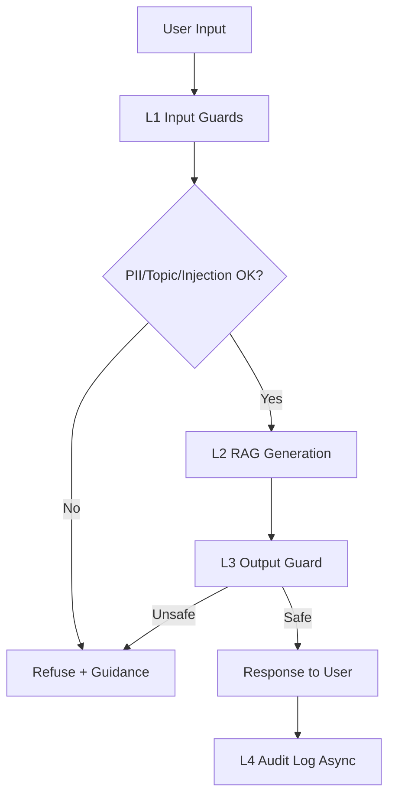

# Lab 24 Blueprint (Production Draft)

## Section 1: SLO Definition

| Metric | Target | Alert Threshold | Severity |
|---|---|---|---|
| Faithfulness | >= 0.85 | < 0.80 for 30 min | P2 |
| Answer Relevancy | >= 0.80 | < 0.75 for 30 min | P2 |
| Context Precision | >= 0.70 | < 0.65 for 1h | P3 |
| Context Recall | >= 0.75 | < 0.70 for 1h | P3 |
| P95 Latency (guarded) | < 2500 ms | > 3000 ms for 5 min | P1 |
| Guardrail Detection Rate | >= 90% | < 85% | P2 |
| False Positive Rate | < 5% | > 10% | P2 |

Current run snapshot:
- Faithfulness: 0.119
- Answer Relevancy: 0.081
- Context Precision: 0.068
- Context Recall: 0.161
- L1 P95: 1131.9 ms
- L3 P95: 1249.4 ms
- Total P95: 6837.7 ms

## Section 2: Architecture Diagram

Latency budget annotation:
- L1 target P95: < 50 ms
- L2 target P95: < 2200 ms
- L3 target P95: < 100 ms
- L4 async: does not block response

## Section 3: Alert Playbook

### Incident: Faithfulness drops below 0.80
- Severity: P2
- Detection: continuous eval alert
- Likely causes: retrieval drift, prompt drift, stale index
- Investigation: compare CP/CR trend, check prompt/version diff, verify corpus index freshness
- Resolution: retriever tune/reindex, rollback prompt, rerun eval gate

### Incident: Guardrail false positives > 10%
- Severity: P2
- Detection: moderation dashboard alert
- Likely causes: over-sensitive topic threshold, output guard model drift
- Investigation: inspect blocked safe samples, check threshold changes
- Resolution: calibrate threshold, add allowlist patterns, re-evaluate on legit suite

### Incident: P95 latency > 3s
- Severity: P1
- Detection: runtime latency monitor
- Likely causes: external API delay, oversized context, sequential processing
- Investigation: layer-level latency breakdown, dependency status
- Resolution: enable parallelism, reduce context size, cache retrieval, fallback model route

## Section 4: Cost Analysis (100k queries/month)

| Component | Unit Cost | Volume | Monthly Cost |
|---|---:|---:|---:|
| RAG generation (gpt-4o-mini) | $0.001/query | 100,000 | $100 |
| RAGAS eval (1% sample) | $0.01/query | 1,000 | $10 |
| LLM Judge (tiered) | mixed | 11,000 | $60 |
| Input guard (Presidio self-host) | near-zero | 100,000 | $0 |
| Output guard (Groq/API est.) | $0.0005/query | 100,000 | $50 |
| **Estimated Total** |  |  | **$220** |

Optimization ideas:
- Dynamic eval sampling by risk tier
- Judge tiering: cheap-first and escalate hard cases
- Output guard cache for repeated prompts
